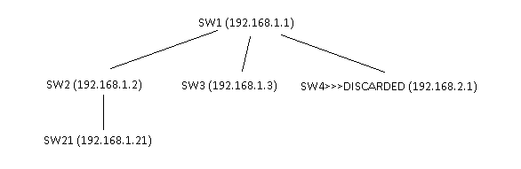

# Cisco Switches Crawler (cisco_crawler)

**cisco_crawler** - утилита для построения сети зависимостей коммутаторов cisco и вывода информации в виде JSON строки.

```sh
cisco_crawler -h
Usage of cisco_crawler.exe:
  -address string
        ip address of the switch
  -include string
        ip addresses (separated by commas) included in the selection. Example: [192.168.1.1,192.168.1.0/24]
  -password string
        the user's password. If not specified, the application will ask for a password
  -pretty
        beautiful print of the result
  -user string
        the name of the user to access the switches
  -verbose
        show verbose
```

### Пример запуска:

```sh
cisco_crawler.exe -address 192.168.1.1 -include "192.168.1.0/24" -user "usr" -password "pass" -pretty
```

### Пример вывода результата:
```sh
{
   "network": [
      {
         "name": "SW4>>>DISCARDED",
         "address": "192.168.2.1",
         "neighbors": [
            {
               "name": "SW1",
               "address": "192.168.1.1"
            }
         ]
      },
      {
         "name": "SW3",
         "address": "192.168.1.3",
         "neighbors": [
            {
               "name": "SW1",
               "address": "192.168.1.1"
            }
         ]
      },
      {
         "name": "SW1",
         "address": "192.168.1.1",
         "neighbors": [
            {
               "name": "SW4>>>DISCARDED",
               "address": "192.168.2.1"
            },
            {
               "name": "SW2",
               "address": "192.168.1.2"
            },
            {
               "name": "SW3",
               "address": "192.168.1.3"
            }
         ]
      },
      {
         "name": "SW2",
         "address": "192.168.1.2",
         "neighbors": [
            {
               "name": "SW1",
               "address": "192.168.1.1"
            },
            {
                "name": "SW21",
                "address": "192.168.1.21"
            }
         ]
      },
      {
         "name": "SW21",
         "address": "192.168.1.21",
         "neighbors": [
            {
               "name": "SW1",
               "address": "192.168.1.2"
            }
         ]
      }
   ]
}
```
### Соответствует схеме:


### Примечание:
- во время работы утилиты могут выводиться логи с ошибками, например ошибка аутентификации. В данном случае такой коммутатор будет добавлен в вывод, но обход его соседей не будет произведен.
- если к имени коммутатора добавлено **">>>DISCARDED"**, то это означает, что данный коммутатор отброшен фильтром и не обрабатывался утилитой.